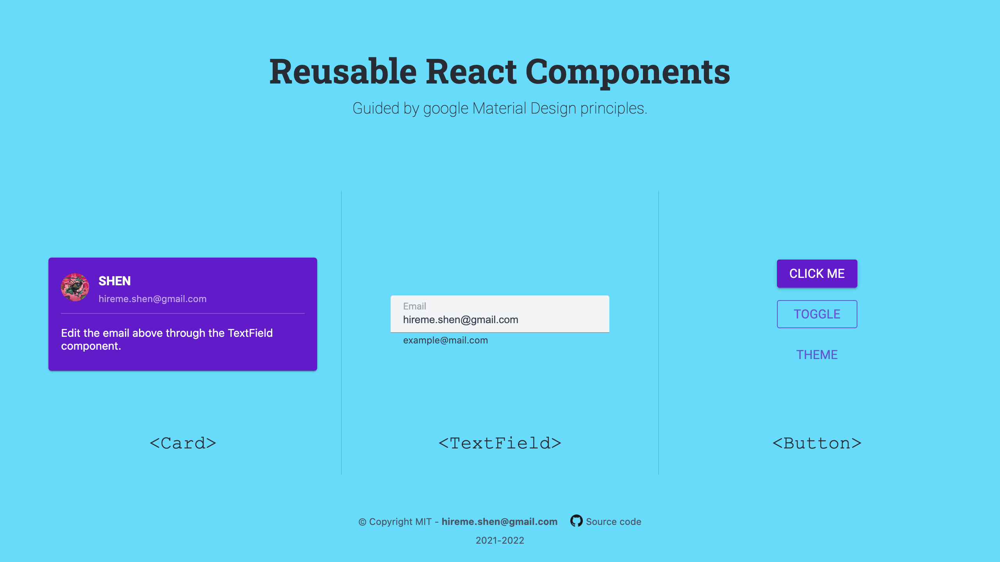

# material-react-components

           

Reusable react components guided by google material design principles. Doesn't use `material` or `material-ui`(MUI) framework. 100% handcrafted.

Online preview: [ciaoshen.com/material-react-components](http://ciaoshen.com/material-react-components)

Happy hacking!
